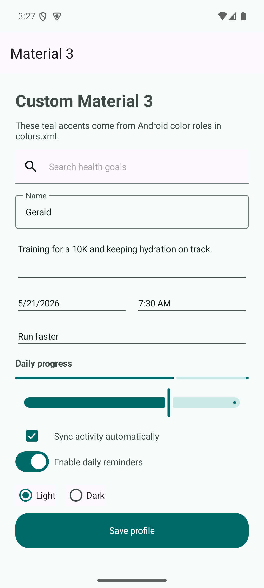

# .NET MAUI Material 3 Customization Sample

This sample shows how to enable Material 3 for a .NET MAUI Android app and customize colors at both layers:

- Android's native Material 3 theme through `Platforms/Android/Resources/values/colors.xml`.
- MAUI/XAML styling through `Resources/Styles/Colors.xaml`.



## Important files

- `MauiMaterial3CustomizationSample.csproj` enables Material 3 with `<UseMaterial3>true</UseMaterial3>` and pins the MAUI package to `10.0.60`.
- `Platforms/Android/Resources/values/colors.xml` overrides both the legacy Android aliases and the Material 3 `m3_sys_color_*` roles used by the native Android Material 3 theme.
- `Resources/Styles/Colors.xaml` defines the same teal Material 3-inspired palette for cross-platform MAUI resources.
- `MainPage.xaml` includes a `Colors.xaml` card with explicit XAML bindings, followed by native MAUI controls that get their Android styling from `colors.xml`.
- `App.xaml` intentionally only merges `Resources/Styles/Colors.xaml` so global implicit XAML styles do not hide the native Material 3 colors.

## Run it

Install the .NET 10 SDK with the MAUI workload, then run:

```bash
dotnet restore
dotnet build -t:Run -f net10.0-android
```

For real Android Material 3 theme changes, update the `m3_sys_color_light_*` and `m3_sys_color_dark_*` values in `colors.xml`, not only `colorPrimary`.

For app-level MAUI styling, update `Resources/Styles/Colors.xaml` and bind those resources from XAML with `StaticResource` or `AppThemeBinding`.
